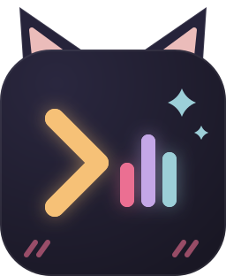

<p align="center">
  
</p>

# YuTuTui!

[English](README.md) · [한국어](README.ko.md) · **日本語**

[](https://github.com/Ochichan/Yututui/releases)
[](https://github.com/Ochichan/Yututui/actions/workflows/ci-pr.yml)
[](https://github.com/Ochichan/Yututui/releases)
[](LICENSE)

ターミナルの中で楽しむ YouTube Music — 速くて、キーボードで操れて、RAM をじわじわ食うブラウザのタブも広告もありません。すべて3文字のコマンド一つで: `ytt`。Rust + ratatui。MIT。

毎日使えるくらいには安定していますが、まだ速く動いている最中です。


[プレイヤーの静止画を見る](docs/media/player.png)

### [▶ ライブデモ・機能ツアー → ochichan.github.io/Yututui](https://ochichan.github.io/Yututui/)

**📖 ターミナルは初めて？** [やさしいマニュアル](MANUAL.ja.md)が、音楽・ラジオ・ローカルデッキ・Spotify のお引っ越しまで、すべてのモードを専門用語なしで一歩ずつ案内します。

---

## インストール

パッケージマネージャのコマンド（brew、scoop、nix、yay）は `ytt` と補助ツール（mpv、yt-dlp、ffmpeg）を
**一度に**まとめて入れます。直接インストーラとソースビルドは `ytt` のみを入れ、補助ツールは
確認して足りないものを案内します。

| OS | 一行でOK |
| --- | --- |
| **macOS** | `brew install Ochichan/tap/yututui` |
| **Windows** | `scoop bucket add extras; scoop bucket add yututui https://github.com/Ochichan/scoop-bucket; scoop install yututui` |
| **Linux** — 任意のディストロ、[Nix](https://nixos.org/download) | `nix run github:Ochichan/Yututui` |
| **Linux** — Arch | `yay -S yututui-bin` |
| **Linux** — その他 | 下のインストーラを実行 |
| **ソースからビルド** | `./install.sh --build`（[Rust](https://rustup.rs) が必要） |

```sh
curl -fsSL https://raw.githubusercontent.com/Ochichan/Yututui/main/install.sh | bash
```

Windows 直接インストーラ:

```powershell
irm https://raw.githubusercontent.com/Ochichan/Yututui/main/install.ps1 | iex
```

<details>
<summary><b>ダウンロードを検証する</b> <i>（任意）</i></summary>

すべてのリリースに `checksums.txt`（SHA-256）と GitHub のビルド provenance attestation が付きます。
動いているブランチ（main）ではなく最新リリースに固定したインストーラも使えます:

```sh
curl -fsSL https://github.com/Ochichan/Yututui/releases/latest/download/install.sh | bash

# チェックサム（成果物と checksums.txt を同じフォルダに置いて）:
sha256sum -c --ignore-missing checksums.txt        # macOS: shasum -a 256 -c

# Provenance — このリポジトリのリリースワークフローが作った成果物である証明 (GitHub CLI):
gh attestation verify yututui-linux-x64.tar.gz --repo Ochichan/Yututui
```

</details>

Windows ではスタートメニューの **YuTuTui!** を選んでください。Tray 補助アプリが
Windows Terminal を開いて `ytt` を起動し、Tray アイコンの右クリックメニューにも
**Open Player** があります。`ytt.exe` の直接ダブルクリックにも対応し、終了後も
コンソールが残るためエラーを読めます。macOS のメニューバー版にも同じ
**Open Player** 操作があります。Linux ではターミナルから `ytt` を実行するか、その
コマンド用のデスクトップランチャーを作る軽量な方式です。

そのあと `ytt` を実行。何かおかしければ `ytt doctor` が直すべき箇所を正確に教えてくれます — 詳しくは[トラブルシューティング](#トラブルシューティング)へ。

<details>
<summary><b>Tray 補助アプリ (macOS / Windows)</b></summary>

macOS と Windows のリリースには、メニューバー / 通知領域のミニプレイヤー `yututray` が含まれます。

| チャンネル | インストールされるもの | Tray の起動 |
| --- | --- | --- |
| macOS Homebrew | `ytt`, `yututray`, ランタイムツール | `yututray --background` |
| Windows Scoop | `ytt.exe`, `yututray.exe`, ランタイムツール, スタートメニューショートカット | `yututray --background` または **YuTuTray!** |
| 直接インストーラ / ソースビルドスクリプト | `ytt`; macOS/Windows では `yututray` も同梱 | `yututray --background` |
| Linux | MPRIS メディア連携入りの `ytt` | 別の tray アプリはなし |

ログイン時の自動起動は任意です: `yututray --install-startup`。

`yututray` と `yututray --background` は Tray 専用で起動し、`--mini` はネイティブのミニプレイヤーを開きます。起動中にもう一度素のコマンドを実行すると、2 つ目の Tray アイコンを作らず、既存インスタンスにミニプレイヤーの表示を依頼します。Windows では左クリックがミニプレイヤーをトグルし、右クリックがメニューを開きます。macOS はステータス項目のネイティブメニューを維持し、**Show Mini Player** からミニプレイヤーを表示します。

固定していないミニプレイヤーはポップオーバーのように振る舞い、フォーカスが離れると隠れます。固定すると常に表示・常に最前面になり、モニター基準の位置も復元されます。Tray 専用とミニ専用のモードはタスクバー/Dock とアプリスイッチャーに出ません。

</details>

### 再生ツール

YuTuTui! は再生に **mpv**、検索とストリーム解決に **yt-dlp**、ダウンロードの
後処理に **ffmpeg** を使います。パッケージ版にはすべて含まれます。直接導入や
ソースビルドで不足している場合は、生のプロセスエラーではなく、OS 向けコマンドの
コピー・セットアップガイド・**再確認**ボタンを備えた案内カードを表示します。
詳しい診断には引き続き `ytt doctor` を利用できます。POSIX 環境では継承される
ライフタイム lease のために **mpv 0.33 以降**が必要です。

`ytt` は mpv の起動を非公開 guardian 経由で行います。guardian は owner heartbeat を
使い、POSIX は継承 mpv `fd://` IPC lease、Linux は `PR_SET_PDEATHSIG` を追加し、Windows は
代わりに close 時終了の Job Object を使います。これらが mpv を `ytt` owner の寿命に
結びます。単独 Unix TUI も、識別できる直接/conmon PTY や対応する
tmux/screen/Zellij クライアントを失うと安全側に終了し、不可能または曖昧な
multiplexer 照会は二回失敗した場合に終了します。通常の Windows console control
event にも対応します。ただし、維持された ConPTY/tmux-control broker や、同種類で
繰り返しネストした tmux/Screen/Zellij の detach はクライアント
内部から証明できません。これらの場合は `ytt daemon` またはホスト側の寿命
supervisor/lease を使ってください。詳細は
[ターミナル互換性](docs/terminal-compatibility.md#terminal-lifetime-detection)を参照してください。

## クイックスタート

```sh
ytt
```

新しいプロファイルの初回起動では、10 秒間 **検索** の場所を案内します。表示された
検索キー（通常は `s`）を押すか **検索** をクリックしてください。一度完了すれば、
次回からは表示されません。

1. **`s`** を押して、曲名を入力し、**`Enter`**。
2. **`↑`/`↓`** で移動して **`Enter`** で再生。
3. いつでも **`?`** を押せば、常に最新の全キー一覧が出ます。

以上。音楽が流れます。

**ターミナルは初めて？** 設定 → 全般で **ビギナーモード** をオンにすると、次回の起動に対話型の9ステップ案内が加わります — 最初のステップで UI 言語（English / 한국어 / 日本語）を選べます — [やさしいマニュアル](MANUAL.ja.md)でも、すべてのモードを自分のペースで学べます。

<details>
<summary>ビギナーモードの案内を見る</summary>


</details>

## ツアー

以下の機能はすべて **[機能ツアー](https://ochichan.github.io/Yututui/)** でライブで、詳しく見られます。

### プレイヤー — 本物のアルバムアート & 同期歌詞

実際のカバー画像がターミナルにそのまま描かれます（Kitty/Sixel/iTerm2 自動検出、画質は設定で Standard/High/Original から選択）。**`Shift+L`** でその下を時間同期の歌詞が流れます。表示中の歌詞行をクリックすればその時点へシークでき、**`z`** / **`Shift+Z`** で歌詞を 0.1 秒ずつ早く / 遅くできます。歌詞が読み込まれると **`[ − 0.0s + ]`** が 3 秒間表示され、**`[±]`** に折りたたまれた後はハンドルをクリックして再び 3 秒間開き、**`−/+`** で微調整できます。プレイヤーのコントロールはすべての画面の下部にドッキングされ（**`Shift+B`** で折りたたみ、クラシックな上部レイアウトも設定ひとつで復帰）、アルバムアートは残りの空間の中央に配置されます。ウィンドウを約 32×14 未満まで縮めるとアプリ全体が小さなミニプレイヤーになり、広げれば元に戻ります。

### カタログは七つ、検索窓は一つ

検索で **`Tab`** を押すと YouTube Music、SoundCloud、Audius、Jamendo、Internet Archive、Radio Browser、そして OpenSubsonic 音楽サーバーを行き来できます — 全部まとめても可、結果には `[SRC]` タグ付き。


### DJ Gem ストリーミング

**`Ctrl+R`** は、いま聴いている曲を軸にした果てしないステーションを作ります。おすすめ曲にはキューと Now Playing の横にクリック可能な **`?`** が付きます。キューを開いた状態で **`w`** を押すと選択中の行を、それ以外の場所では現在の曲を説明します。カードにはおすすめの出典が常に表示され、DJ Gem が提供した場合はその役割・平易な理由・確信度も加わります。モデル詳細なしで選ばれた曲は出典のみ表示されます。

### DJ Gem アシスタント *（任意）*

**`g`** を押して言葉で頼むだけ: *「lo-fi をかけて」「雨の日プレイリストを作って」*。無料の Gemini キーが必要で、それ以外の機能はキーなしで全部動きます。

### ターミナルの上に浮かぶミュージックビデオ

**`v`** で小さな mpv ウィンドウに MV が浮かびます。*動画の自動連続再生*をオンにすると次の曲の MV へ自動で続き、mpv ウィンドウでは `Space`, `.`, `,`, `q`, `f`, `m` が効きます。

### ラジオモード — いま流れている曲まで分かる

**`Alt+Shift+R`** はアプリ全体をネットラジオのチューナーに変えます。**`i`** を押せば Gemini が生放送でいま流れている曲名を教えてくれて、**`f`** でそのままお気に入りに。**`a`** で**アトラス**: 点字ドットで描いた、回してズームできるライブ局の地球儀 — ドラッグ・弾き（アニメーション有効時）・ホイール、点をクリックして再生、国をクリックして探索 — 画像プロトコル不要です。

### ライブラリ、キュー & ダウンロード

ライブラリでそのままプレイリストを作り（DJ Gem に頼んでも OK）、**`c`** でキューを開き、**`d`** はカバーアートとタグ入りの m4a に保存 — **`Shift+D`** はリスト丸ごと。

### ローカルデッキ — ディスク上のすべての音楽のオフラインプレイヤー

ライブラリで **`Alt+Shift+L`** を押すと、ダウンロードとローカルファイルのための没入型プレイヤーが開きます — アルバム、アーティスト、ジャンル、スマートリストまで。**Find（検索）**を選ぶか **`Ctrl+F`** を押すと、曲・アルバム・アーティスト・ジャンル・フォルダ・ローカルで再生できるプレイリスト項目を、オンライン検索へ切り替えることなく探せます。**`/`** はこれまでどおり、今見ているセクションだけを絞り込みます。範囲や並び順を Refine で整え、コレクションを開いたり、一件または結果全体を再生・キュー追加したりできます。

ローカル再生と Find が使うのは、すでにパソコンにあるファイルだけです。別途有効にした連携機能はネットワークを使う場合があり、**インポートセッション**の手動オンライン候補検索は、ローカルデッキを出る前に明示的に確認します。ローカルデッキのテーマも通常・ラジオモードとは別に記憶されます。新規インストールでも以前の設定でも、最初は **Local Launch** で始まり、その後はローカルデッキで保存したテーマに戻ります。詳しいツアーは[マニュアル](MANUAL.ja.md)へ。

### どこからでも操作

メディアキー、macOS コントロールセンター、Windows SMTC + トレイのミニプレイヤー、Linux MPRIS、どのシェルからでも `ytt -r` — さらにターミナル不要の headless デーモンも。

### 自分好みに

テーマ14種（34の色ロールすべて hex 編集可能）、アニメーション40種 — 流れ星や回る ASCII ドーナツからフルキャンバスのショーピース（花火、ライフゲーム、パイプ、プラズマ）まで — プリセット付き10バンド EQ、オーディオ出力デバイスの選択、ラウドネスノーマライズまで。UI そのものも English / 한국어 / 日本語 の3言語に対応しています — 設定 → 全般 → **言語** で順に切り替わります。


<details>
<summary>再生・オーディオ出力・EQ の設定を見る</summary>

<a href="docs/media/audio-output.png"></a>

</details>

### レトロモード

トグル一つですべてが CP437 安全になります — 素の Linux コンソールや年季の入った SSH セッション向け。アルバムアートも正真正銘の ASCII アートに。レトロモードでは UI 言語も英語に固定されます — CP437 には CJK のグリフがないためです。

### Spotify はコマンド一行でお引っ越し

`ytt transfer import <url>` — チェックポイント、再開、あいまいな曲はマッチレポートへ。設定方法は下の[リファレンス](#リファレンス)に — 最初から最後まで手を引いてほしいなら[マニュアル](MANUAL.ja.md)へ。

### ショートカットはアプリが覚えています

**`?`** を押すと、*あなたが変えた*キーがそのまま反映されたライブチートシートが出ます — アプリ操作は再設定でき、UI 全体がマウス対応。安全・モーダルキーは固定です。

<details>
<summary>曲の右クリックメニューを見る</summary>

<a href="docs/media/context-menu.png"></a>

</details>

## 基本のキー

アプリで **`?`** を押すと完全なライブチートシートが出ます — *あなたが変えた*キーがそのまま反映され、アプリ操作は設定 → ホットキーで変更できます（安全・モーダルキーは固定）。基本だけ:

| キー | 動作 |
| --- | --- |
| `Space` | 再生 / 一時停止 |
| `,` / `.` | 前 / 次の曲（mpv 動画ウィンドウでも） |
| `←` / `→` · `↑` / `↓` | シーク · 音量 |
| `s` | 検索（`Tab` でカタログ選択） |
| `l` / `c` | ライブラリ / キュー |
| `x` / `r` | シャッフル / リピート切り替え |
| `↑`/`↓` 長押し · `Shift`+`↑`/`↓` | リストを高速スクロール（加速）· 範囲選択 |
| `f` / `d` | 高く評価/低く評価（ライブラリでは選択曲のお気に入り）/ ダウンロード |
| `Shift+D` | リスト / プレイリスト全体をダウンロード |
| `Shift+L` | 同期歌詞。表示中の行をクリックしてその時点へシーク |
| `z` / `Shift+Z` | 歌詞を 0.1 秒早く / 遅く（`[±]` で `−/+` を 3 秒間再表示） |
| `v` | MV オーバーレイ |
| `!` / `@` | 前 / 次のチャプターへジャンプ（mpv 準拠） |
| `Shift+S` | スリープタイマー — 分数を入力（または `off`）、フェードアウト後に一時停止 |
| `Shift+B` | ドッキングされたコントロールボックスの折りたたみ / 展開 |
| `←` / `→` · `Ctrl+←` / `Ctrl+→` | テキスト欄で一文字ずつ · 単語単位でカーソル移動 |
| `Backspace` / `Ctrl+Backspace` | テキスト欄で一文字 / 前の単語を削除 |
| `Ctrl+H` | プレイヤーに戻る（レガシーな曖昧ターミナルでは安全なテキスト編集 fallback が優先） |
| `Ctrl+R` | DJ Gem ストリーミング |
| `w` | 選択中のキューのおすすめ曲、または現在の曲を説明 |
| `g` | DJ Gem アシスタント |
| `o` | 設定 |
| `Ctrl+Q` | 終了 |

> **ハングル配列でも大丈夫。** ショートカットは 2ボル式の字母を理解します（`ㅂ` は `q` として効く）— IME を切り替える必要はありません。マウス派なら画面のすべてがクリックでき、ホイールは音量に効きます。行をドラッグすると範囲選択（検索結果でもライブラリと同じ）、`Ctrl`+クリック（macOS は `⌘`+クリック）で離れた行を個別に選択/解除できます。行を右クリックするとコンテキストメニューが開き、ジェスチャーは `config.json` の `mouse_bindings` で再設定できます。全リストはフッターの **mouse** ボタンのマウスチートシートで。

## トラブルシューティング

まずはいつでも: **`ytt doctor`** が mpv、yt-dlp、ffmpeg を点検し、直すべき箇所を正確に教えてくれます。さらに深くは `ytt doctor --verbose`、ターミナルの能力確認は `ytt doctor terminal --json`。

### 再生

| 症状 | 対処 |
| --- | --- |
| 何も再生されない、再生でエラー | mpv か yt-dlp がありません — `ytt doctor` を実行。 |
| 音が違うデバイスから出る | 設定 → 再生 → **オーディオ出力** で検出されたローカル出力から選択; **オーディオバックエンド** は mpv オプションを公開します。 |
| 昨日は動いたのに今日は動かない | YouTube が何か変えました — `ytt tools update` の後、`ytt tools status --why`; 管理版更新が原因なら `ytt tools use system`。 |
| 複数の曲が 403/429 や "YouTube rejected the stream" で失敗 | YouTube のボット対策です。`ytt doctor --verbose` を実行し（PO トークン/oauth の準備状況も表示されるようになりました）、[リファレンス](#リファレンス)の Cookie の項と対応する JS ランタイムを確認してください; アクティブな yt-dlp は `ytt tools status --why` で。[PO トークンプロバイダー](https://github.com/yt-dlp/yt-dlp?tab=readme-ov-file#po-token-guide)または [oauth プラグイン](https://github.com/coletdjnz/yt-dlp-youtube-oauth2)でたいてい確実に直ります。 |
| 特定の曲だけ再生できない | サインインが必要かも — [リファレンス](#リファレンス)の Cookie の項を参照。 |
| アプリがシェルと違う yt-dlp を実行する | 仕様です（管理版コピー vs `PATH`）— [リファレンス](#リファレンス)の *yt-dlp の選択* を参照。 |

### インストール & 起動

| 症状 | 対処 |
| --- | --- |
| `ytt: command not found` | 新しいターミナルを開く。まだなら、インストーラが出力した `PATH` 行を追加。 |
| 直接インストーラ / ソースビルド後に補助ツールがない | 一行インストーラは `ytt` 本体だけを入れます — `ytt doctor` が何をどう入れるか教えてくれます。 |

### 表示 & ターミナル

ターミナル対応はエミュレータごとに違います — YuTuTui! は機能を検出し、可能な範囲で fallback します。環境確認は `ytt doctor terminal --json`、詳細は [terminal compatibility matrix](docs/terminal-compatibility.md)。

| 症状 | 対処 |
| --- | --- |
| アルバムアートが出ない | 初期設定はオフ: 設定 → 全般 → **アルバムアート**をオンにして再起動。 |
| ターミナルによってアルバムアート/拡大の挙動が違う | `ytt doctor terminal --json` を実行し、[terminal matrix](docs/terminal-compatibility.md) と照合してください。 |
| terminal liveness エラーで TUI が終了する | `ytt doctor terminal --json` とエラーの failure class/stage を保存してください。EOF/HUP と確認済み multiplexer detach は即時終了します。曖昧な cursor 応答と owner-layer 照会は独立して二回確認します。liveness output-gate の競合中は probe を延期し、owner frame/control 出力には別の七秒の制限時間を適用します。ターミナルを閉じても再生を続けたい場合だけ `ytt daemon` を使います。 |
| `Ctrl+Backspace` が `Ctrl+H` のように動く、またはプレイヤー内の移動が効かない | [キーボード入力モード](docs/terminal-compatibility.md#keyboard-input-modes) を参照。直接接続の最新ターミナルは対応していれば正確なプロトコルを交渉し、レガシー/マルチプレクサのセッションはそのバインディングが既定の間、曖昧な `^H` を安全な単語削除用に予約します。 |
| VS Code / Apple Terminal でアルバムアートがカクカク | それらのターミナルには画像プロトコルがありません — halfblock が意図された fallback です。 |
| 素の Linux コンソールや古い SSH で表示が崩れる | レトロモードをオンに（設定 → グラフィック）: すべてが CP437 安全に描き直され、アルバムアートは ASCII アートになります。 |
| SSH / 素の TTY で `v`（MV）が反応しない | 動画オーバーレイは mpv の GUI ウィンドウです — デスクトップセッションが必要です。 |

### Spotify インポート

| 症状 | 対処 |
| --- | --- |
| Spotify で 403 / 「許可リスト外」 | Spotify 開発者ダッシュボードの *User Management* に自分のアカウントを追加し、Client ID のタイプミスを確認。 |
| ブラウザに INVALID_CLIENT / リダイレクト不一致 | リダイレクト URI が**正確に**一致する必要があります: `http://127.0.0.1:9271/callback` — `localhost` ではなく IP、正しいポート、末尾スラッシュなし。 |
| "could not listen on 127.0.0.1:9271" | ポートが使用中です。`config.json` の `spotify.redirect_port` を変更し、ダッシュボードのリダイレクト URI も合わせてください。 |
| Connect を押したがブラウザが開かない | ヘッドレス/SSH では認証 URL がクリップボードにコピーされ `spotify_auth_url.txt` に保存されます — 任意のブラウザに貼り付けて承認してください。 |
| Spotify インポートが「YouTube Music の Cookie が必要」と表示 | YTM のプレイリスト/いいねへのインポートはサインインが必要ですが、ローカルのライブラリプレイリストへのインポートは Cookie なしで動きます。[リファレンス](#リファレンス)の Cookie の項を参照。 |

### アカウント、スクロブル & OS 統合

| 症状 | 対処 |
| --- | --- |
| スクロブルが反映されない | 設定 → アカウントを確認。デーモンは起動時にアカウントを読むので、接続後は再起動を。 |
| コントロールセンター / SMTC / MPRIS に出ない | 設定 → 再生 → **OS メディアコントロール**を確認。何かが一度再生されてから表示されます。 |
| フライアウトに「不明なアプリ」/ 項目が 2 つ | `ytt register-media-identity` を一度実行（項目 2 つ = mpv 自身のメディアセッション。mpv ≥ 0.39 では自動で無効化されます）。 |
| デスクトップ更新通知が出ない | 更新案内は About/ステータスにも残ります。デスクトップ通知はターミナル、tmux、OS の通知対応に依存する best-effort 動作です。 |

### そのほか全部

| 症状 | 対処 |
| --- | --- |
| DJ Gem が反応しない | 設定 → DJ Gem に無料の Gemini キーを入れ、**Enable DJ Gem** をオンに。 |
| キーを変えすぎて混沌 | 設定 → 全般 → **ショートカットを初期化**。 |

まだ困っている？ [issue を立てて](https://github.com/Ochichan/Yututui/issues) OS を教えてください。

## リファレンス

<details>
<summary><b>リモート操作 & デーモン</b></summary>

`ytt` が再生中なら、どのシェルからでも操作できます:

```sh
ytt -r pp                  # 再生 / 一時停止   (別名: toggle, play, pause)
ytt -r next / prev         # 曲の移動
ytt -r volume 40           # 音量を直接指定; up / down も可
ytt -r seek-to 90          # 1:30 へジャンプ
ytt -r streaming on        # 無限ストリーミング: on / off / toggle
ytt -r play "lofi"         # デーモン: 検索して最初の結果を再生
ytt -r status              # 一行の「再生中」(--json はスクリプト用)
ytt -r info                # owner 種別、プロトコル、capability（トークンは非表示）
ytt -r queue-list          # 番号付きキュー; 現在の曲は > で表示
ytt -r queue-play 2        # 2番目を再生（キュー番号は1から）
ytt -r settings-show       # 秘密情報を含まない簡潔な設定一覧
ytt -r watch --json        # 既定の player/queue/system イベントを NDJSON で購読
ytt -r watch all           # 現在提供中の全て: player, queue, settings, system
```

i3 / sway のメディアキー割り当て: `bindsym XF86AudioPlay exec ytt -r pp`。

リモート操作は同じマシン上の現在の OS ユーザーだけが使える非公開 Unix ソケットまたは
Windows named pipe に限定されます。LAN/HTTP リモートではないため、runtime ディレクトリを
共有・公開しないでください。`queue-list` のキュー番号は1から始まります。

ターミナルなしの再生は headless デーモンで:

```sh
ytt daemon start --resume   # 保存済みキュー/セッションを復元して再生
ytt daemon stop             # デーモン停止 + mpv の後始末
```

デーモンでもストリーミング、スクロブル、OS メディアコントロールはそのまま動きます。`ytt` を二度起動しても二つ目のプレイヤーは生まれません（本当に欲しければ `ytt --new-instance`）。全コマンド: `ytt -r --help`、`ytt daemon --help`。

</details>

<details>
<summary><b>スクロブルの設定 (Last.fm / ListenBrainz)</b></summary>

`ytt` は実際に聴いたものだけをスクロブルします — 標準のハーフトラック/4分ルール、いいね→love 同期、そしてネットワークを試す*前に*ディスクへ書かれるオフラインキュー（クラッシュしても失いません）。TUI とデーモンの両方で動きます。

- **Last.fm** — 設定 → **アカウント** → ブラウザで承認、または `ytt auth lastfm`。自前ビルドは `config.json` の `scrobble.lastfm.api_key` / `api_secret` で設定できます（[API アカウントの作成](https://www.last.fm/api/account/create)）。
- **ListenBrainz** — [ユーザートークン](https://listenbrainz.org/settings/)を設定 → アカウントに貼るか、`ytt auth listenbrainz <token>`。セルフホストは `scrobble.listenbrainz.api_url` を設定。
- 未配達の再生記録は設定ファイルの隣の `scrobble-queue.jsonl` で待機し、自動で配達されます。

</details>

<details>
<summary><b>Spotify インポート / エクスポート</b></summary>

```sh
ytt auth spotify --client-id <YOUR-CLIENT-ID>   # 初回のみ PKCE ブラウザ接続
ytt transfer import <spotify-url-or-id>          # → 新しい YTM プレイリスト
ytt transfer import liked --to likes             # Spotify のいいね → YTM のいいね (順序保持)
ytt transfer import <url> --media music-video    # → 別の公式系 MV プレイリスト
ytt transfer import liked --media music-video    # Spotify のいいねも同じ MV モードで
ytt transfer import <url> --policy strict        # より保守的なレビュー中心マッチング
ytt transfer export ytm:<id> --to spotify        # Spotify に作成/追加（ライブ同期ではない）
ytt transfer export ytm:<id> --to spotify:<22-character-playlist-id> --sync --dry-run
                                                  # 既存プレイリストへの完全ミラーをプレビュー
ytt transfer backup --dir ~/music-backup --csv   # 全 YTM プレイリスト → JSON (+CSV)
ytt transfer resume <job-id>                     # レート制限/中断後の再開
```

TUI の中でも: 設定 → **アカウント** → *Spotify からインポート…* — 音楽を流したままで。その 4 番目のモード **Music video playlist** は、Library → Playlists に別のミュージックビデオプレイリストを書き出します。

**初回のみの設定（約5分）。** Development Mode の Spotify アプリは自分で許可リストに入れたアカウントしか受け付けないので、各自が自分の個人用アプリを作ります。[Spotify の 2026 年 Dev-Mode ルール](https://developer.spotify.com/documentation/web-api/tutorials/february-2026-migration-guide)では、アプリ所有者に Premium が必要で、新規アプリは Client ID を 1 つだけ持ち、許可リストに入れたユーザーを最大 5 人まで扱えます。クライアント*シークレット*はありません — PKCE はシークレットを使いません。

1. [developer.spotify.com/dashboard](https://developer.spotify.com/dashboard) にログインして **Create app** を押します。
2. **App name** と **App description** は何でも（例: `yututui`）。
3. **Redirect URIs** に `http://127.0.0.1:9271/callback` を**正確に**追加して **Add** を押します。ループバック IP リテラル `127.0.0.1` である必要があり、**`localhost` は不可**（Spotify が拒否）。ポートを変える場合は `config.json` の `spotify.redirect_port` を設定し、ここも合わせます。
4. **Which API/SDKs are you planning to use?** で **Web API** にチェック。
5. 規約に同意して **Save**。
6. アプリ → **Settings** で **Client ID** をコピー（Client secret は不要）。
7. **User Management**（アプリ設定内）を開いて自分のアカウントを追加 — 名前 + Spotify アカウントのメール。新しい Dev Mode アプリはこの許可ユーザーを最大5人まで受け付けます。
8. ytt で **設定 → アカウント → Spotify** を開き、Client ID を貼り付けて **Connect** を押します（または `ytt auth spotify --client-id <ID>`）。ブラウザに Spotify の承認ページが開くので承認すれば完了。ブラウザが開かないヘッドレス/SSH 環境では、URL がクリップボードにコピーされ `spotify_auth_url.txt` にも保存されるので、どの端末でも開けます。

マッチングはメタデータベースで（NFKC 正規化、CJK 安全）、Spotify インポートをキャッシュ優先・アルバム認識・YTM カタログ優先で解決してから、公開 YouTube 動画へ fallback します。CLI の既定は `--policy balanced`; 保守的なレビュー中心マッチングは `--policy strict`、レビュー行を減らすには `--policy aggressive`、一般の公開アップロードでも良い場合のみ `--allow-user-videos`。あいまいな曲は黙って当てずっぽうにせず、ジョブレポートに残ります — `--take-best` / `--min-score` で再実行するか、大きなプレイリストは `--dry-run` で確認してから `ytt transfer resume <job-id>` で書き込みを。

`--media music-video` は Spotify プレイリストと `liked` で使え、保存先の名前を指定しないかぎり `<元の名前> (Music Videos)` プレイリストを別に作ります。YouTube Music の OMV / OfficialSourceMusic 分類と、強く裏付けられた公式チャンネルを優先します。これは公式系の best-effort 判定であり 100% の保証ではありません。公開 API には決定的な「公式ミュージックビデオ」フラグがないためです。明確に拒否されたユーザーアップロードはレビューでも強制できず、未解決の候補はレポートに残ります。

通常の `--to spotify` エクスポートは意図的に非破壊です。プレイリストを見つけるか Spotify の現行 `POST /me/playlists` API で作成し、足りない曲を追加します。Spotify にしかない曲の削除、重複位置の再現、並び替え、以降の編集の監視はしません。

破壊的な一回限りの完全ミラーは、`--to spotify:<22-character-playlist-id> --sync` でプレイリスト ID を明示してください。接続中のアカウントが所有するプレイリストのみ受け付けます。先に `--dry-run` を実行すると追加・削除・並び替えがプレビューされ、ソース行が 1 つでも未解決かソースが切り詰められていれば何も変更しません。実実行はソースの順序と重複を保持し、宛先にしかない曲を削除します。`--yes` がなければ置き換え前にプレビューして確認を求めます。`ytt transfer resume <job-id>` も新しいプレビューを作って再確認し、`resume <job-id> --yes` だけはその確認を意図的にスキップします。

</details>


<details>
<summary><b>サインイン Cookie & ファイルの場所</b></summary>

**PO トークン & oauth — Cookie を超えて。** YouTube が *公開* ストリームまで拒否し始めたら（HTTP 403/429 "YouTube rejected the stream"）、たいてい **PO トークンプロバイダー** が解決策です: [`bgutil-ytdlp-pot-provider`](https://github.com/Brainicism/bgutil-ytdlp-pot-provider) を導入し、その出力が示す yt-dlp 設定行を追加してください。より長持ちするサインインは [`yt-dlp-youtube-oauth2`](https://github.com/coletdjnz/yt-dlp-youtube-oauth2) プラグインです（`yt-dlp --plugin-dirs ... --username oauth --password ''` を一度実行すれば、あとは自動更新されます）。`ytt doctor --verbose` が両方の準備状況を表示するようになりました。

**Cookie（任意）。** 公開曲は匿名で再生できます — メンバー限定/地域制限トラックとアカウントのプレイリストにだけ必要です。YouTube Music の Cookie を **Netscape 形式**で `~/Music/yututui/cookies.txt`（Windows: `%USERPROFILE%\Music\yututui\cookies.txt`）に書き出して再起動してください。**そのファイルはパスワードのように扱い**、*シークレットウィンドウ方式*で書き出すこと: プライベートウィンドウでサインインし、そのタブから `cookies.txt` を書き出して、ウィンドウを閉じます — ブラウザが消えたセッションはローテーションもサインアウトもされません。正しい書き出しには `SAPISID`/`SID` の行があります。

**設定 & データ。**

- 設定: `~/Library/Application Support/yututui/config.json`（macOS）· `~/.config/yututui/config.json`（Linux）· `%APPDATA%\yututui\config.json`（Windows）— その隣に `playlists.json`、`scrobble-queue.jsonl`、`transfers/`。
- ダウンロード: `~/Music/yututui` — **Download dir** 設定か `YTM_DOWNLOAD_DIR` で変更。
- `GEMINI_API_KEY` と `YTM_DOWNLOAD_DIR` 環境変数は、起動時に保存済み設定より優先されます。

**ポータブルな個人データのエクスポート。** アプリで **設定（`o`）→ 全般 → 個人データをエクスポート** を選ぶか、次を実行します:

```sh
ytt data export                         # OS の Downloads フォルダに保存
ytt data export --to ~/existing-folder # 既存のディレクトリを指定
```

`--to` にはファイル名ではなくディレクトリを指定し、YuTuTui! がディレクトリを作ることはありません。他のローカルアカウントが完成ファイルを差し替えられる保存先は拒否します。結果は、既存ファイルを上書きしない所有者専用の新しいバージョン付き JSON ファイルです。機密情報を除いたポータブル設定、曲とラジオのお気に入り、再生・ラジオ履歴、プレイリスト、安全な曲メタデータと公開カタログ ID、推薦シグナル・アーティスト親和度・ステーション設定が含まれます。

メインのアプリまたはデーモンが起動中なら、CLI はそのオーナーの現在のメモリ状態をエクスポートします。`--new-instance` プレイヤーが同時に起動していても、CLI がエクスポートするのは広告されたプライマリだけです。各セカンダリの最新状態は、それぞれの設定画面から個別にエクスポートしてください。現行版の ytt オーナーが 1 つでも動作中なら、オフラインエクスポートはディスクストアを読みません。

認証 Cookie、API キー、OAuth トークンとアカウント識別子、すべてのファイルシステムパスとマシン固有のオーディオ設定、再生・取得元・アートワーク・ラジオストリームの URL、ダウンロード・録音メディアと manifest・sidecar、未送信スクロブル、転送ジョブ・レポートとセッションキュー、AI 使用ログ、生成キャッシュ・アートワークキャッシュ・アプリログ、管理対象ツールのバイナリとパス、デスクトップジオメトリと復旧バックアップは除外されます。

この JSON は**暗号化されず**、個人の再生履歴が含まれるため、保管や共有の際は個人ファイルとして扱ってください。取り込み方は下のエクスポート・インポートの項を参照してください。

</details>

<details>
<summary><b>yt-dlp の選択</b></summary>

**yt-dlp は自動で最新に保たれます。** YouTube は毎週変わるため、`ytt` は自前の yt-dlp を保持し（github.com から SHA-256 検証付き）、{管理版, システム版} の新しい方を使います。そのため、シェルで `yt-dlp --version` と打って見えるものと違う yt-dlp を実行する場合があります。実際の選択と候補を見るには:

```sh
ytt tools status --why
```

復旧用コマンド:

```sh
ytt tools update              # 管理版コピーを今すぐ更新
ytt tools use system          # 管理版 yt-dlp を無視して PATH を使う
ytt tools use managed         # インストール済みの管理版コピーに固定
ytt tools use /path/to/yt-dlp # 特定の実行ファイルに固定
ytt tools unpin               # 通常の managed/system 選択に戻す
```

`YTM_YTDLP` は引き続き最も強い override です。OS の設定で値を変えた場合は、新しいターミナルを開くか、その環境変数を解除してから `ytt tools use ...` の設定を反映させてください。

アプリ自身の yt-dlp 呼び出しは、既定であなたの yt-dlp 設定ファイルを無視するので、シェルのダウンロード用オプションがパース出力を壊しません。アプリのパース呼び出しにも yt-dlp 設定を使うなら `YTM_YTDLP_USER_CONFIG=1`。mpv の `ytdl_hook` 経由の再生は引き続き yt-dlp 設定に従い、検索・プレイリスト取得・メタデータ・プリフェッチ解決・ダウンロードだけが既定で無視します。

</details>

<details>
<summary><b>端末間の暗号化同期</b></summary>

お気に入り・再生履歴・プレイリスト・好みのシグナルを WebDAV フォルダー（Nextcloud、ownCloud、たいていの NAS）経由で複数台にそろえます。アップロード前にローカルですべて暗号化されるため、サーバーには暗号文しか残らず、分かるのはサイズと時刻だけです。自分でオンにするまで無効です。

```sh
ytt sync setup                        # vault を作成。リカバリーキットの保存が必須
ytt sync status [--json]              # Off / Up to date / Syncing / Offline — will retry / Needs attention
ytt sync now                          # ローカルとリモートの状態をいまマージ

ytt sync pair create                  # 10 分間有効な使い捨て接続コードを表示
ytt sync pair join <CODE>             # 新しい端末で実行し、既存の端末で承認
ytt sync pair join --resume           # 中断した参加をコードなしで再開
ytt sync pair cancel                  # 終わっていないローカルの参加を破棄

ytt sync devices [--json]             # 有効な端末と削除済み端末
ytt sync revoke <DEVICE_ID>           # 端末を削除し暗号化チェックポイントを鍵かけ直す
ytt sync recovery export --to <DIR>   # リカバリーキットを検証してコピー
ytt sync audit [--json]               # 個人情報を伏せた同期監査ログ
```

WebDAV の資格情報は画面に表示せずに入力し、コマンド引数としては受け取りません。エンドポイントは loopback でないかぎり HTTPS が必須です。status と audit の出力はエンドポイント・パス・秘密情報を意図的に除いています。

**リカバリーキットはこのパソコン以外に保管してください。** 誰も再発行できません。ただしキットだけから vault を建て直すコマンドはまだないので、キットを復元手段と考えず、承認済みの端末を最低 1 台は残してください。端末を削除すると以降アップロードされたものは鍵かけ直されますが、その端末が**すでに受け取った**ぶんは取り消せません。

アプリ内では **設定（`o`）→ 同期** に同じ流れがあります。

</details>

<details>
<summary><b>自分の音楽サーバー（OpenSubsonic / Navidrome）</b></summary>

```sh
ytt server setup                                   # サーバー接続を試して保存
ytt server status [--json]                         # 秘密情報を伏せた接続状態
ytt server remove                                  # プロフィールを削除（ローカルデータは維持）

ytt server scrobbles list [--json]                 # 判断待ちの再生レポート
ytt server scrobbles retry <OPAQUE_ID>             # 未送信として再試行
ytt server scrobbles mark-sent <OPAQUE_ID>         # 再試行せず送信済みとして扱う

ytt server playlists pending [--json]              # 判断待ちのプレイリスト作成
ytt server playlists abandon <LOCAL_PLAYLIST_ID>   # ガードを忘れるだけ（どちらも削除しない）

ytt server history enable --experimental           # Navidrome の詳細履歴（既定はオフ）
ytt server history disable                         # 保存した専用パスワードも削除
```

パスワードと API キーは画面に表示せずに入力し、コマンド引数としては受け取りません。パスワード認証はリクエストごとに新しい salt トークンを使うため、平文のパスワードは送信されません。実験的な詳細履歴は専用パスワードを別に要求し、オフにしても通常のサーバー接続には影響しません。

アプリ内では **設定（`o`）→ 音楽サーバー**。

</details>

<details>
<summary><b>個人データのエクスポート・インポート</b></summary>

```sh
ytt data export [--to DIR] [--schema 1|2]   # バージョン付き JSON。資格情報とメディアは含まない
ytt data import <FILE>                      # マージのプレビュー（既定）
ytt data import <FILE> --apply              # 原子的に適用
```

エクスポートは暗号化されず再生履歴を含むため、個人ファイルとして扱ってください。別のデータセットは何も削除せずにマージされ、同じデータセットのバンドルは因果順にマージされるので、自分の古いエクスポートを取り込み直しても新しい再生履歴は巻き戻りません。

</details>

## セキュリティ

脆弱性を見つけたら、公開 issue ではなく
[GitHub の非公開脆弱性報告](https://github.com/Ochichan/Yututui/security/advisories/new)を
使ってください — サポート対象バージョンと成果物の検証方法は [SECURITY.md](SECURITY.md) にあります。

## 謝辞 & ライセンス

🙏 **[@ZZNN75](https://github.com/ZZNN75)** さんへ、本物の QA 時間に大きな感謝を — あなたが*出会わない*粗い角は、この方が先にぶつかってくれたから滑らかなのです。🫡

MIT。フォークして、出荷して、好きにどうぞ。

アトラス地球儀の海岸線は [Natural Earth](https://www.naturalearthdata.com/)（パブリックドメイン）のデータを [omarchy-radio-atlas](https://github.com/AksharP5/omarchy-radio-atlas)（MIT）が整理したポリゴンとして使用し、地球儀の操作モデルもそのプロジェクトに倣っています。局のリストはコミュニティ運営の [Radio Browser](https://www.radio-browser.info/) から取得します。
